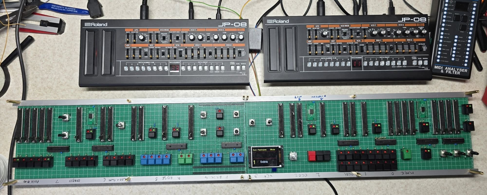

# Jupiter 8 Editor / Assigner

This project was put togther to control a pair of Roland boutique JP-08 synth modules.

These modules are 4 note polyphonic and can be used as half of a sound card for a Jupiter 8.

The pair togther create an 8 note polyphonic synth comparable to a Jupiter 8.

The editor send MIDI CC updates to each module when a patch is recalled or a parameter is edited.

It also includes a key assigner that takes care of whole, dual and split modes and solo, unision, poly1 and poly2 modes.

I'm going to include an arpeggiator section similar to the Jupiter 8 and patch memories.

The JP-08 modules have portamento, delay and chorus effects that are hidden from the front panel and only available via MIDI.

The VCF Bend is not practical to implement so I've replaced that with aftertouch depth and destinations.

# Things to do

* Add the MIDI clock and external clock
* Add the performances
* Build the mixer section and DAC control.

